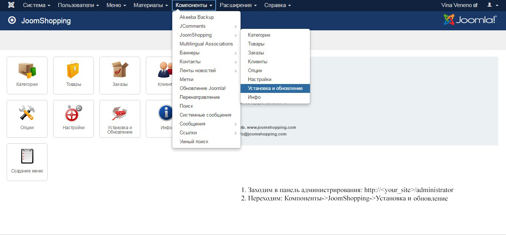
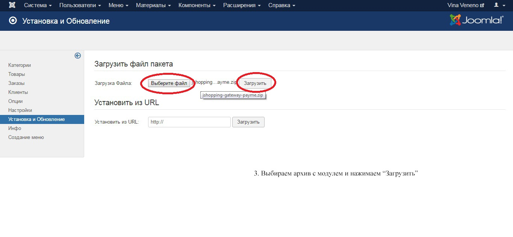
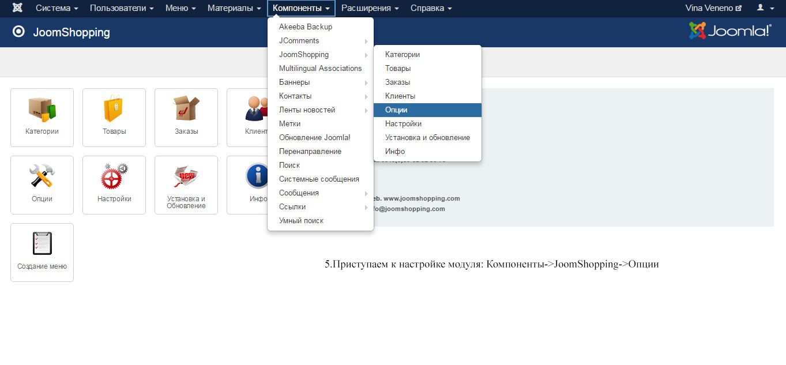
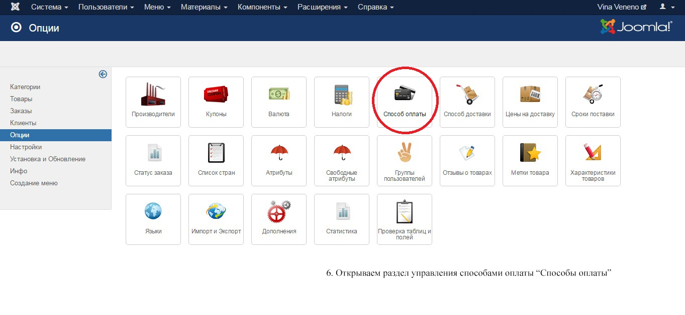
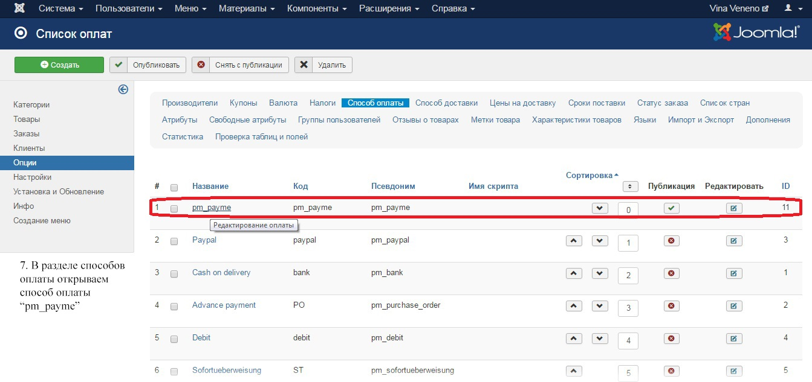
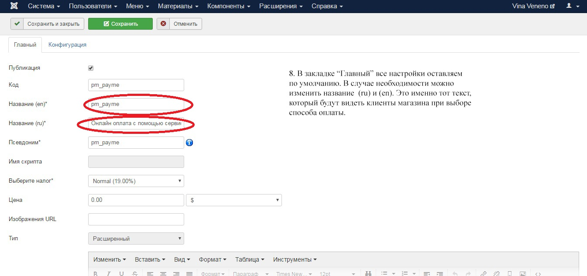
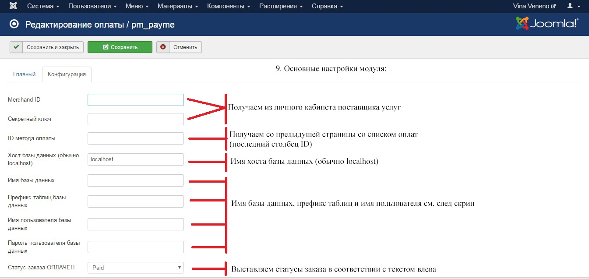
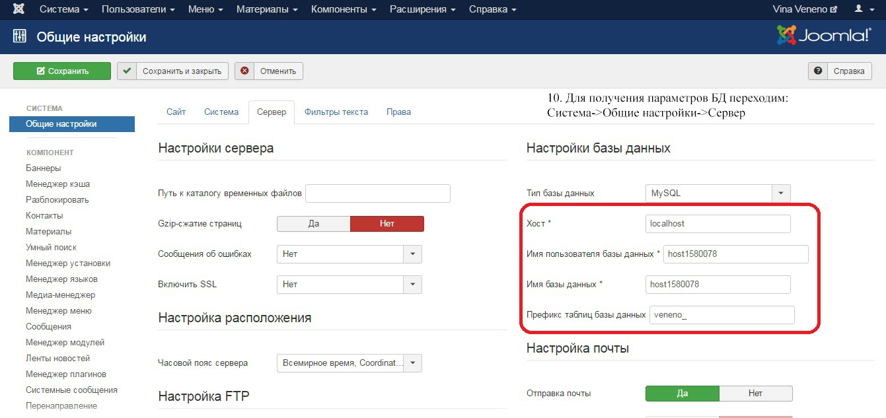
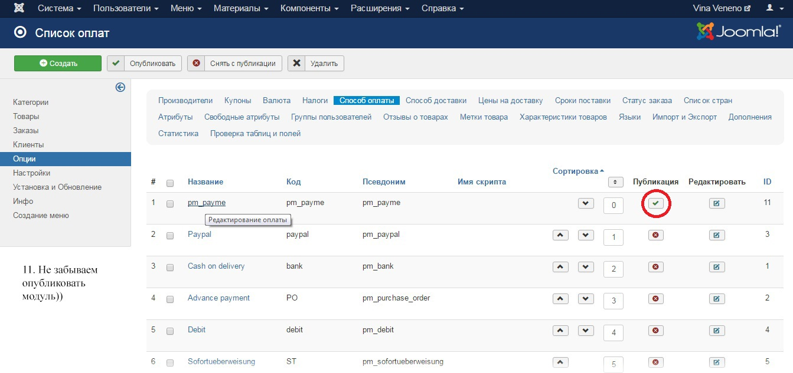

# Joomshopping Payment Payme gateway

## Требования

+ [Регистрация](https://merchant.paycom.uz/#/register) в кабинете поставщика услуг Paycom™
+ [Joomla](https://www.joomla.org/) 3.x и выше
+ [JoomShopping](https://joomshopping.pro/) 4.15 и выше

## Установка плагина

Скачайте фаил [jshopping-gateway-payme.zip](https://github.com/PaycomUZ/jshopping-gateway-payme/releases/latest)

Загрузите файл плагина:

Откройте опции:

Отредактируйте способ оплаты 

Настройте способ оплаты с помощью Payme

Заполните необходимые поля:

Просматриваем настройки для плагина:

Настройка завершена
